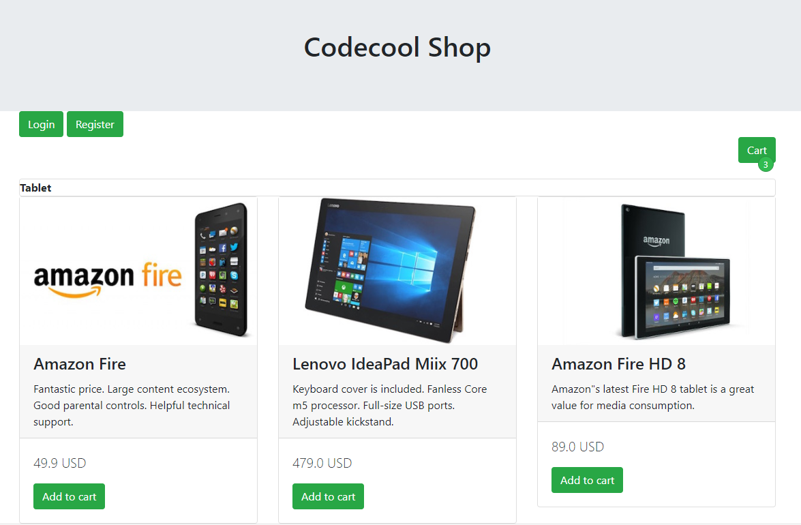
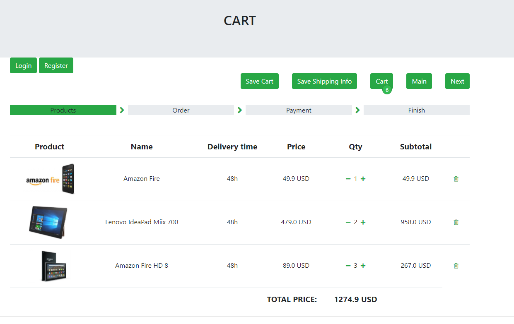
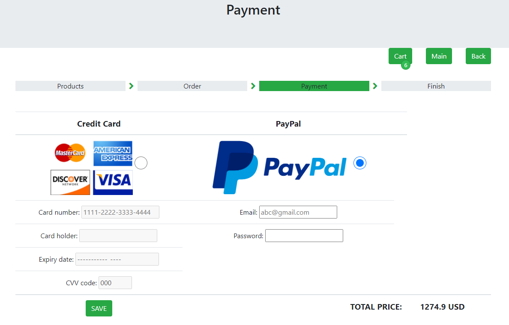

# Codecool shop (sprint 1,2)

_Project developed in February 2021. (Codecool course)_

_Developers: Joanna Rzeszótko-Doniec, Jakub Zieliński, Piotr Wójcik_

_Key words: web application, online shop, java, maven, thymeleaf, database (DaoJdbc),logback. In progress: mocking, unit tests, log in, user registration_

## Project assumptions

- web application for online shop
- PostgreSQL
- User can add to the cart, edit it, save , delete items from the cart
- After the cart is approved user should enter addres for delivery and pay the bill
- A brief summary of an order is send to user as an e-mail

